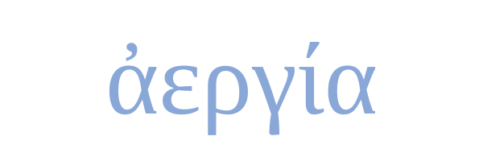

<p align="center">
  <a href="https://pypi.org/project/aergia-lang/">
    
  </a>
  <a href="https://pypi.org/project/aergia-lang/">
    
  </a>
  <a href="https://pypi.org/project/aergia-lang/">
    
  </a>
  <a href="https://pypi.org/project/aergia-lang/">
    
  </a>
</p>

<p align="center">
  
</p>

<p align="center">
  Aergia is a minimalist yet still usable programming language, depending on your definition of usable.
</p>

## Documentation
Documentation for Aergia can be found [here](https://las-r.github.io/aergia/).

## IDE Support
Here is a list of every IDE with Aergia support:
- [VSCode](https://github.com/las-r/aergia/releases/tag/Editors)
- [Sublime Text](https://github.com/las-r/aergia/tree/main/editors/sublime/README.md)

## Tools
Aergia is provided with a few basic tools to aid in development:
- **Lethes**: A basic program minifier.
```bash
aergia --lethes <filename.aer>
```

- **Otia** (planned): A basic program formatter.
```bash
aergia --otia <filename.aer>
```